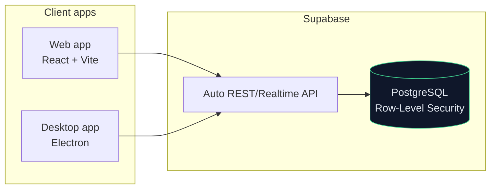

# ClickEays — Field-Service CRM

> A full-stack **CRM for field-service / maintenance businesses** — clients,
> scheduled visits, warranties, preventive-maintenance plans, loyalty and
> satisfaction surveys — built on a **Postgres (Supabase)** backend with
> row-level security and shipped as both a **web** and a **desktop (Electron)** app.

<p>
  
  
  
  
  
  
</p>

> [!NOTE]
> **Personal / portfolio project** — built to demonstrate full-stack, data-driven
> product development. Not a professional deliverable.

---

## What it does

A service company (installation, maintenance, warranties) needs one place to
manage the whole customer lifecycle — from a lead, through scheduled visits and
the services performed, to warranties, recurring maintenance and loyalty. This
app models that lifecycle end to end.

### Features

| Module | Purpose |
|--------|---------|
| **Clients** | Customer records, status (active / inactive / lead), history |
| **Leads** | Pipeline: new → contacted → qualified → converted / lost |
| **Visits** | Scheduled diagnoses, installations and maintenance appointments |
| **Services** | Service catalog with pricing, duration and categories |
| **Warranties** | Product/service warranties with status and expiry tracking |
| **Maintenance plans** | Preventive schedules with frequency and next-due dates |
| **Loyalty** | Points and tiers (bronze → platinum) |
| **Satisfaction surveys** | 1–5 ratings and feedback tied to visits |
| **Discount policies** | Percentage/fixed discount rules with validity windows |
| **Message templates** | Reusable WhatsApp / email / SMS templates with variables |
| **Activity logs** | Audit trail of system actions |

## Architecture



- **Frontend:** React 18 + TypeScript, Vite, Tailwind CSS, React Router, `lucide-react` icons.
- **Backend:** Supabase — managed PostgreSQL with **Row-Level Security** on every table and an auto-generated API consumed via `@supabase/supabase-js`.
- **Desktop:** the same web build packaged with **Electron** (`electron-builder`, NSIS installer).
- **Schema:** a single versioned migration under [`supabase/migrations/`](supabase/migrations/).

## Tech Stack

React · TypeScript · Vite · Tailwind CSS · React Router · Supabase (PostgreSQL + Auth + RLS) · Electron

## Repository Structure

```
crm/
├── src/
│   ├── pages/         # one screen per CRM module (Clients, Visits, ...)
│   ├── components/    # Layout, Modal, shared UI
│   ├── lib/           # supabase client
│   └── types/         # database types
├── supabase/migrations/   # versioned SQL schema (RLS enabled)
├── main.cjs           # Electron entry point
└── vite.config.ts
```

## Local Setup

Prerequisites: Node.js 18+ and a [Supabase](https://supabase.com) project (free tier).

```bash
npm install

# Configure your Supabase credentials
cp .env.example .env    # then set VITE_SUPABASE_URL and VITE_SUPABASE_ANON_KEY

# Apply the schema to your Supabase project (SQL editor or Supabase CLI),
# using supabase/migrations/*.sql

npm run dev             # web app at http://localhost:5173
npm run electron        # desktop app
npm run build           # production web build
```

## Environment Variables

| Variable | Purpose |
|----------|---------|
| `VITE_SUPABASE_URL` | Supabase project URL |
| `VITE_SUPABASE_ANON_KEY` | Supabase anon/public key |

No secrets are committed; configure them via `.env` (git-ignored).

## Security

- **Row-Level Security** enabled on all tables, with policies for authenticated access.
- Only the Supabase **anon key** is used client-side (never the service-role key).

## Future Improvements

- Automated tests (component + e2e) and a CI pipeline.
- Role-based access (technician vs. manager) on top of RLS.
- Dashboards for visit throughput, warranty expirations and maintenance due.
- CSV/PDF export and WhatsApp/e-mail sending from the message templates.

---

<sub>Built by <a href="https://github.com/Vitor5236">João Vitor</a> · Personal / portfolio project.</sub>
